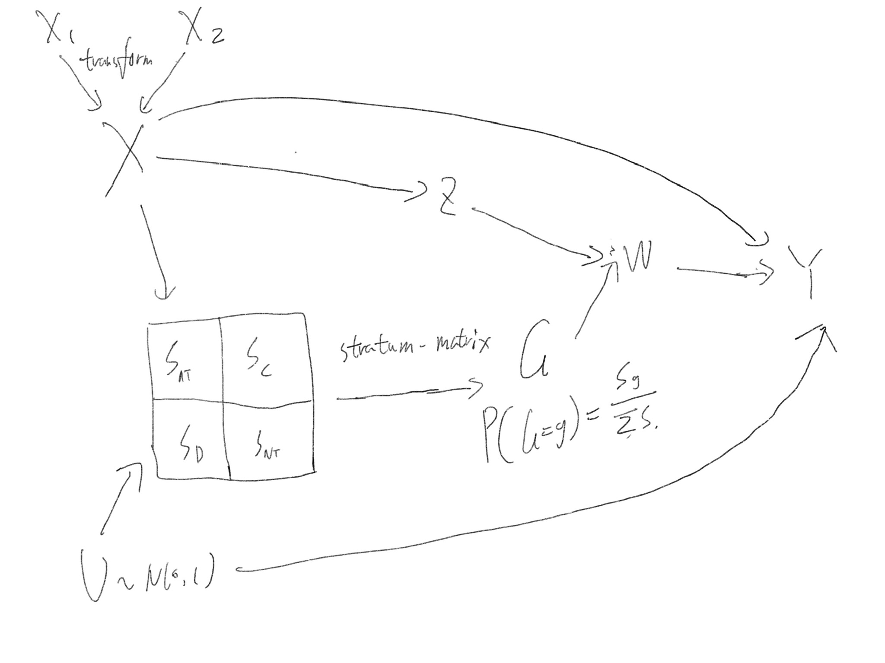
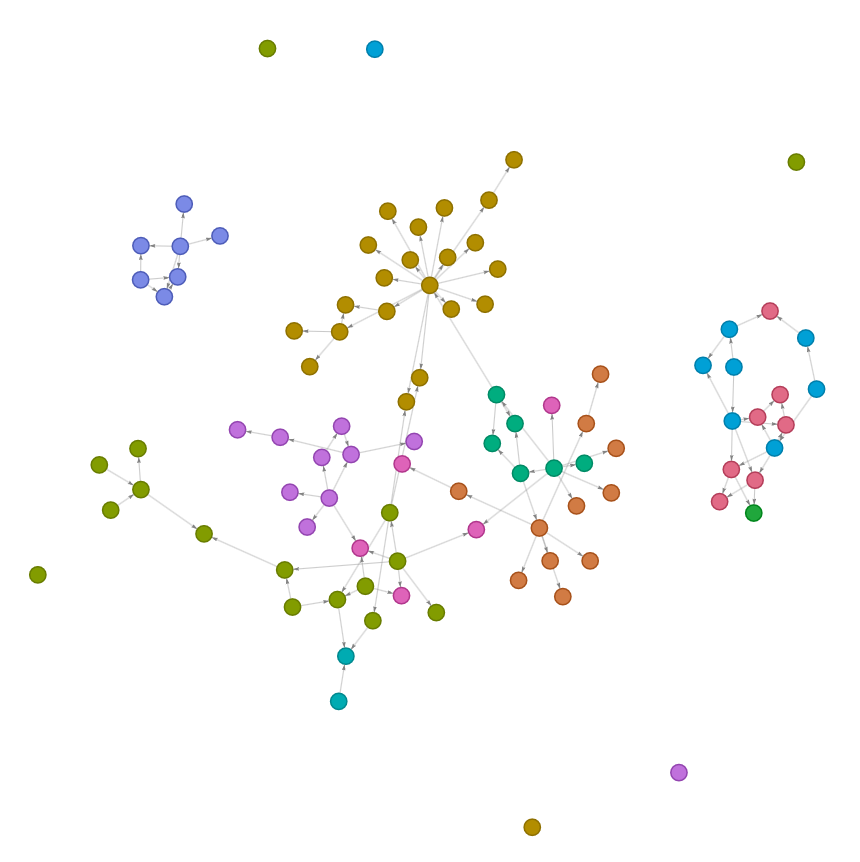
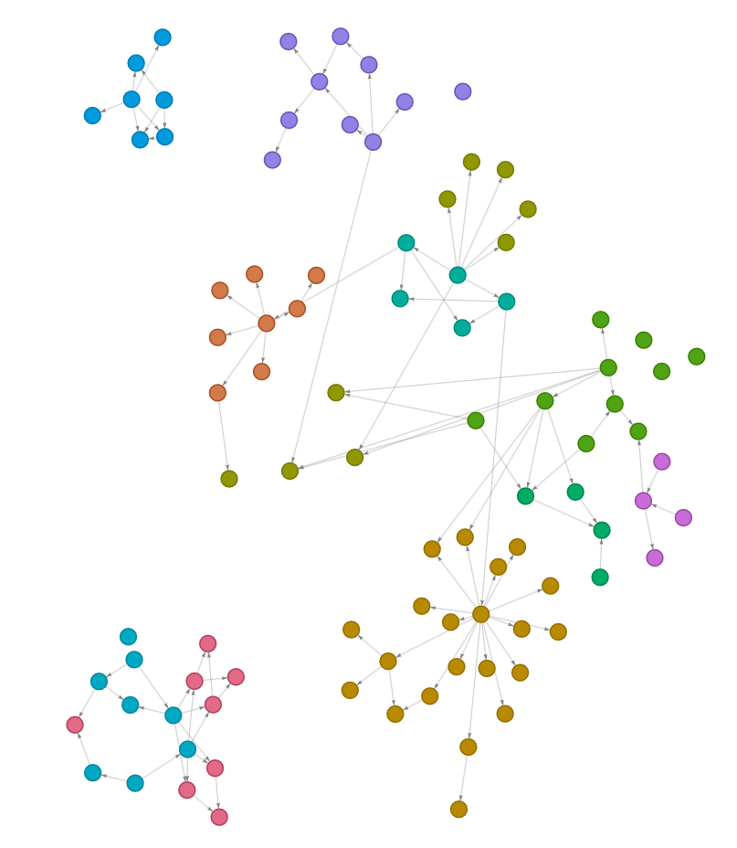
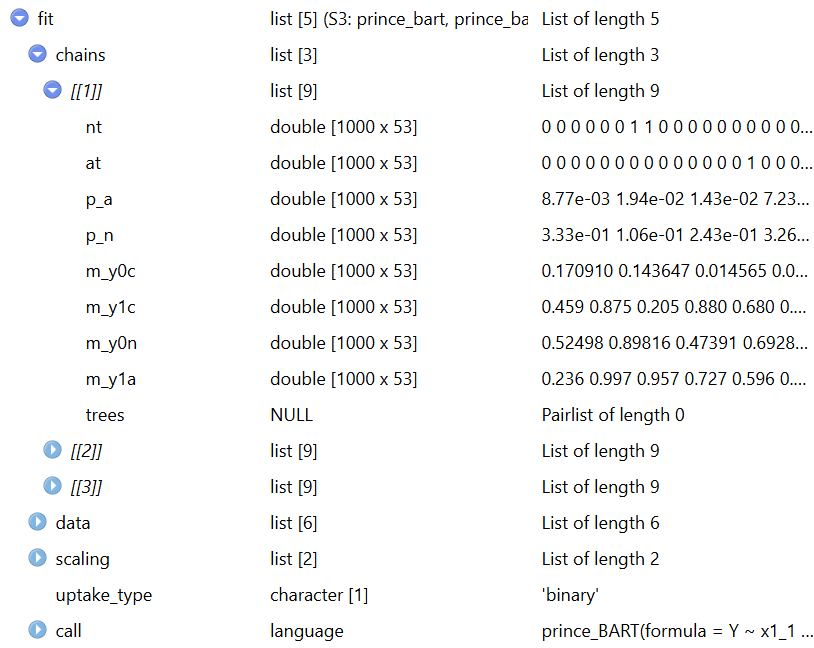

# simulation setup

The following figure shows how the simulated data is generated:

{width="686"}

The following parameters are used for the simulation function:

```{r, eval = FALSE}
ps_simulate_data <- function(
    n = 100L, # number of subjects
    nx1 = 1L, # numbr of continuous covariates
    nx2 = 1L, # number of binary covariates
    w_levels = 2L, # the possible levels W can take. if 2, binary.
    y_type = c("binary", "continuous"), # the type of outcome
    seed = NULL, # seed
    x1_transform = c("linear", "sin", "relu", "sigmoid"), #a function to transform x1 to introduce some non-linearity
    weights = "random", # the weights or coefficients used to generate the data
    stratum_weights = "default", # a matrix to control stratum. By default, monotinicity condition will hold and each strata will have equal weight
    sigma_y = 1 # continuous y only
  ){}
```

returns a list with:

data: observed data

alldata: unobserved principle strata etc

weights: weights used to reproduce the simulation

support: the principle strata structure matrix

## Example use 1: binary W with linear relationship

```{r}
library(princeBART)
dat = ps_simulate_data(n = 5, seed = 1)
dat
```

## Example use 2: count W with three levels

principle strata now forms a 3 be 3 upper trangular matrix

```{r}
dat = ps_simulate_data(n = 5, w_levels = 3, seed = 1)
dat
```

## Example use 3: violation of monotonicity conditon.

```{r}
dat = ps_simulate_data(n = 5, stratum_weights  = "full", seed = 2)
dat
```

## Example use 4: non-linear transformation of X1 with continuous outcome

```{r}
dat = ps_simulate_data(n = 5, x1_transform = "relu",, y_type = "continuous", seed = 1)
dat
```

# Relocation of functions for better code structure

currently the functions of the package is scattered across different files. The following graph is generated with the help of AI, and used to assist with function re-location.

```{r, eval =FALSE}
library(pkgnet)
library(visNetwork)

# Find package-level functions and their source files
r_files <- list.files(
  path = "R",
  pattern = "\\.[Rr]$",
  full.names = TRUE
)

function_files <- do.call(
  rbind,
  lapply(r_files, function(path) {
    expressions <- parse(path)
    
    function_names <- vapply(
      expressions,
      function(expr) {
        is_function_assignment <-
          is.call(expr) &&
          identical(expr[[1]], as.name("<-")) &&
          is.call(expr[[3]]) &&
          identical(expr[[3]][[1]], as.name("function"))
        
        if (is_function_assignment) {
          as.character(expr[[2]])
        } else {
          NA_character_
        }
      },
      character(1)
    )
    
    function_names <- function_names[!is.na(function_names)]
    
    data.frame(
      node = function_names,
      source_file = rep(basename(path), length(function_names)),
      stringsAsFactors = FALSE
    )
  })
)
# Build the pkgnet function graph
reporter <- FunctionReporter$new()
reporter$set_package("princeBART")

function_network <- reporter$graph_viz
nodes <- function_network$x$nodes

# Match each pkgnet node to its source file
nodes$source_file <- function_files$source_file[
  match(nodes$id, function_files$node)
]
nodes$source_file[is.na(nodes$source_file)] <- "Unknown"

# Assign one color per source file
source_files <- sort(unique(nodes$source_file))

file_colors <- setNames(
  grDevices::hcl.colors(
    length(source_files),
    palette = "Dark 3"
  ),
  source_files
)

nodes$group <- nodes$source_file
nodes$color <- unname(file_colors[nodes$source_file])
nodes$title <- paste0(
  "<b>", nodes$label, "</b><br>",
  "Source: ", nodes$source_file
)

function_network$x$nodes <- nodes

# Define groups so visNetwork can create a legend
for (source_file in source_files) {
  function_network <- visGroups(
    function_network,
    groupname = source_file,
    color = list(
      background = file_colors[[source_file]],
      border = file_colors[[source_file]]
    )
  )
}

function_network <- visLegend(
  function_network,
  useGroups = TRUE,
  position = "right",
  width = 0.22
)

function_network


```

{width="460"}

The current structure is more clear. each .R file is doing a clear task.

{width="392"}

# Re-factorization of model outcome

## original structure

imp: a 4D array in the shape of (n_iter, n_chains, n_variables=2, n_subjects)

probs: a 4D array in the shape of (n_iter, n_chains, n_variables=4, n_subjects)

tress: a data frame of shape (\> 10 million \* 7)

the current summary function manipulates such 4D array, which is difficult to understand. The trees data form is too large to even open the fit object.

## new structure:

chains: a list of length n_chains

within each chain, a list of 6 objects: (nt, at, p_1, p_n, ... m_y1a). each object will be a matrix of shape (n_iter, n_subjects). more objects will be included for ordinal variables as well. trees will also be stored by chain. This makes the get_mix_tau function very simple now



## tidybayes structure:

The tidybayes package, however, requires a method called as.mcmc.list, which requries transforming the chains into structures like:

list(chain1, chain2, ...)

while each chain is a matrix, with each row an iteration, each column a variable. for us, it would look like

| p_a\[1\]         | p_a\[2\] | ... | m_y1a\[N\] |
|------------------|----------|-----|------------|
| ....             |          |     |            |
| ....             |          |     |            |
| ...              |          |     |            |
| n_iteration rows |          |     |            |

I personally don't think it is very clean, especially that all variables are subject specific. I think having a matrix for each variable is cleaner. though we could implement the as.mcmc.list() function to transform the data into this format, to use some tidybayes features (though I cannot think of any currently).

# Demonstration of workflow

```{r}
library(princeBART)
library(future)


dat = ps_simulate_data(n = 200)

plan(multisession, workers = 6)

fit <- prince_BART(
  Y ~ x1_1 + x2_1 | Z | W,
  data = dat$data,
  uptake_type = "auto",
  n_chains = 6,
  n_warmup = 1500,
  n_samples = 2500
)

summary(fit)


```

compare with the ground truth:

```{r}
library(tidyverse)
dat[["alldata"]] %>%
  filter(G == "(0,1)") %>%
  mutate(TE = mean_y1-mean_y0) %>%
  pull(TE) %>%
  mean()


```

# A universal extract() function

instead of exporting all the mate_c() functions, create a function that takes a princeBART_fit object and a string describing the information needed to be extracted. This will make the code structure cleaner.

The document of this function will store the formula on how each of the values are calculated. (unfortunately, the current mate_c() functions outputs the posterior summary, not a value)

Example:

```{r}

princeBART::extract(fit,"mate_c")
```

Todo: discuss what are the values that needs to be extracted or do not implement this, expose the matt_c() functions instead. extract() duplicates with other packages, probably not a good name..

# Questions:

the package actually implements count W, not ordinal W. consider naming issues?

# Next steps:

examining the correctness of the count, general_BART and effect heterogenety, or

disregard the correctness concerns raised by AI, start working on writing the documentation and example.
