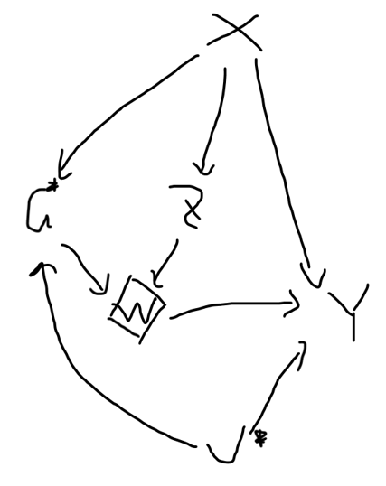
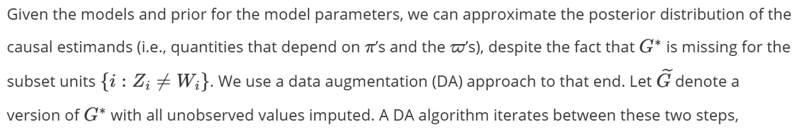
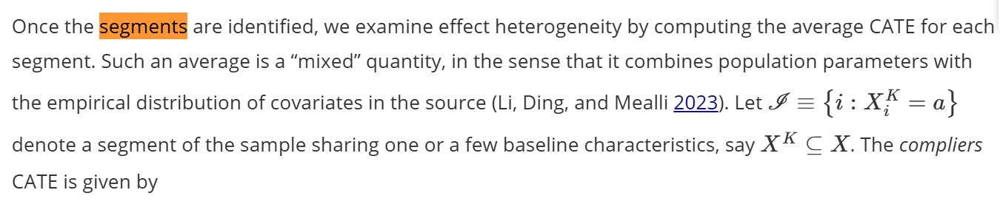

# Summary of the methods from the paper

## principle stratification with BART within the source population

This is the proposed DAG representing the relationship between the variables: G and U are unobserved, W is deterministic of G and Z.

{width="286"}

Goal: estimate the complier average treatment effect

The likelihood of observed data XZWY can be factorized according to the dag, and are proportional to P(G\|X), P(Y\|G,Z,X)

G is only partially observed through Z and W. To solve this, use a data augmentation algorithm that:

1.  Take the data from previous iteration,
2.  Fit 6 (binary) BART models.
3.  Get posterior predictive probability of G, and sample from it to create new data.

Additionally, the instrument propensity P(Z=1\|X) is estimated for each observation, and treated as an additional covariate (why? get into it again). subjects with propensity with extreme values will be trimmed if instrument_overlap is not NULL.

## interpret the result using Effect Heterogeneity

Choose a subset of predictors by fitting other models with the BART prediction as the outcome, and the subset of covariates as the predictors. examing the correlation between BART prediction and new prediction, and use forward selection to find the best subset of covariates.

fit a shallow tree to define segments of the data sharing similar predictions, and calculate individual CATE for each segment, then take the average.

Why do we want to do this?

find groups with high effects. very general in other papers.

## generalization to target population

Basically an IPW version of CATE by clusters.

To get non-parametric estimates of the target population distribution of X, Bayesian bootstrap is used. Specifically, bayesian bootstrap is equivalent with weighting ovservations using a dirichelet distribution.

dye to two stage sampling design in survey.

# Analysis of the package

## Code structure

```{r}
library(pkgnet)
result <- CreatePackageReport('princeBART')
```

## Entry point 1: binary prince BART

prince_BART(): primary function, first do some preprocessing and validation. Then, the propensity is calculated for each subject using BART, and trim observations. After that, the function prepare for parallel compute, and finally run the chains to .run_psbart_binary_chains()

.run_psbart_binary_chains(): run all, chains and combine the results. to run one chain, the function calls .fit_psbart_binary()

.fit_psbart_binary(): first do some initialization, and run initialize_samplers(). Then, a for loop is called, which sample from the 6 BART models, calculate the corresponding probablity estimates, and generate new data for next iteration. It also stores the results after warm-up.

initialize_samplers(): create 6 dbartsSampler object using custom function dbarts_binary(), which replaces original dbarts() function.

dbarts_binary(): A customized function that hacks into dbarts package, and force outcomes to be binary. (Because such condition could appear for some iterations of the outcomes, and dbarts will treat it as continuous then). It also removes zero offset for computation reasons?

## Entry point 2: ordinal prince BART

Not studied yet.

## Entry point 3: general to target population

1500 lines. I am not sure if this is necessary... The code has not been analyzed yet.

## Entry point 4: Segment heterogenety

Not analyzed yet

## Summary and other functions

# Bugs and typos found

## 1

One problem found: devtools::install_github is decrepted in devtools 2.5.0. consider publishing it to cran?

## 2



{i: z_i=w_i}

## 3

## 4

Discuss the hacked function dbarts_binary() : do a feature request for dbarts. check what offset is.

## 5

the current location of files is messy: ask AI for code structure. important functions with own file (check?).

concerns: arrays renames. ask AI to check for code that is error prone.

# next week: 

get into the code especially user interface summary.

week after that: better introduction?
